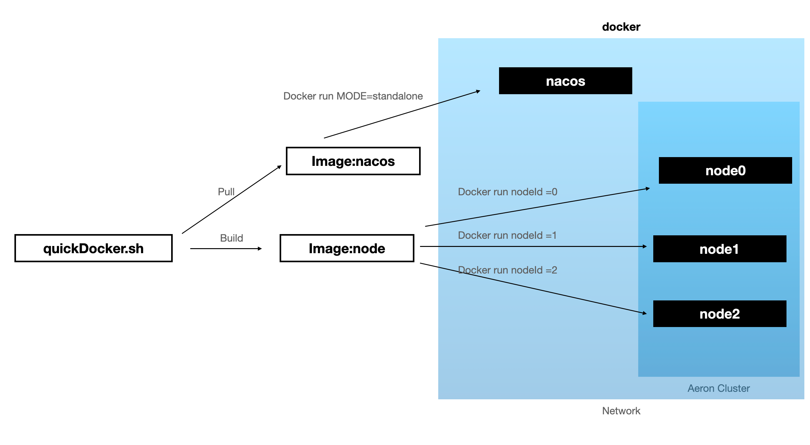
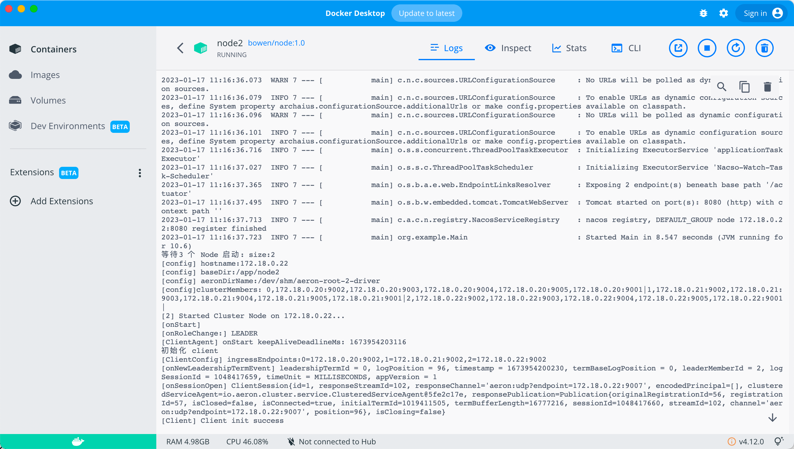

# aeron-cluster-demo
这是一个 aeron cluster 的 demo 模版。此项目使用脚本`quickDocker.sh` 完成项目编译打包部署并基于 docker 启动集群多节点和 nacos 服务。自定义 docker network 完成集群节点通信和 nacos 服务注册；


## 快速开始
前置条件
- [ ] MacOS
- [ ] 安装且配置 [maven](https://maven.apache.org/) 和 [docker Desktop](https://www.docker.com/)
```
# MacOS
open /Applications/Docker.app  # run the Docker.app
git clone https://github.com/NTP1996/aeron-cluster-demo.git
cd aeron-cluster-demo
sh quickDocker.sh
```
部署完成后，点击链接能够访问对应服务；
[nacos](http://localhost:8848/nacos/#/serviceManagement?dataId=&group=&appName=&namespace=&pageSize=&pageNo=&namespaceShowName=public)

[node0](http://localhost:8080/)

[node1](http://localhost:8081/)

[node2](http://localhost:8082/)

使用docker desktop 查看各应用日志

# raftlogData
提交到集群的数据是一个（Long，String）元素，集群维护一个`Map<Long, String>`

```
# raftlogData:[key|valueLength|value]
public static int encoder(MutableDirectBuffer buffer, Long key, String value) {
        buffer.putLong(0, key);
        buffer.putInt(8, value.length());
        buffer.putBytes(12, value.getBytes());
        int length = 12 + value.length();
        return length;
    }
```
# todo
- 2.0 raftlog 跨容器生命周期持久化 + snapshot
- 3.0 raftlog 消费应用
